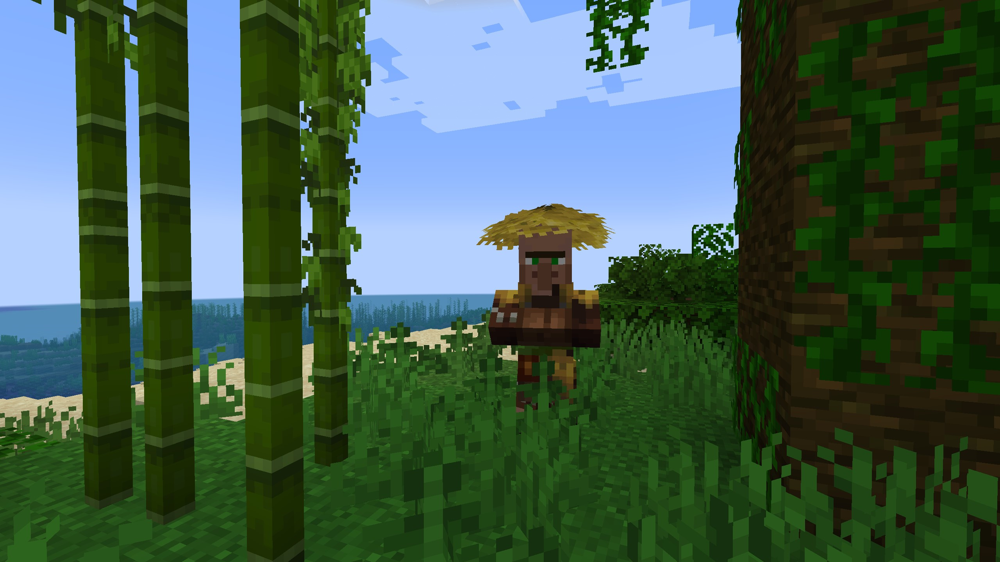
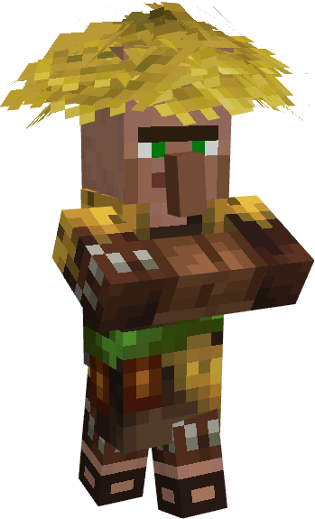

# Porcelain Flowers
A Fabric 1.21 mod where the world comes alive. Plants and animals simulate trophic hierarchy, and villagers work the land they live.

[Repository](https://github.com/koolkid94/Porcelain-Flowers)

## Images

