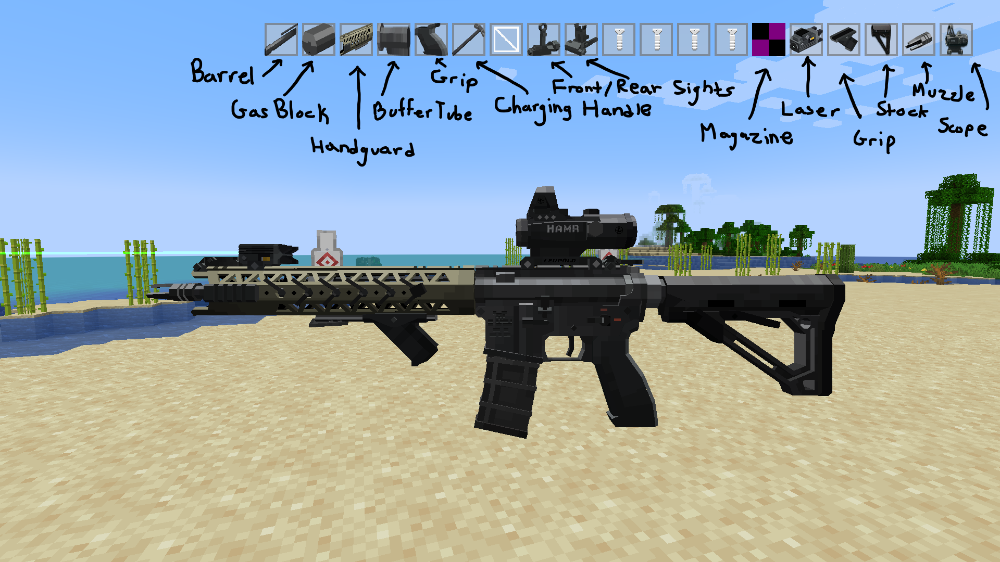
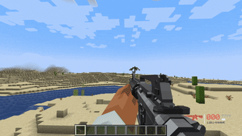
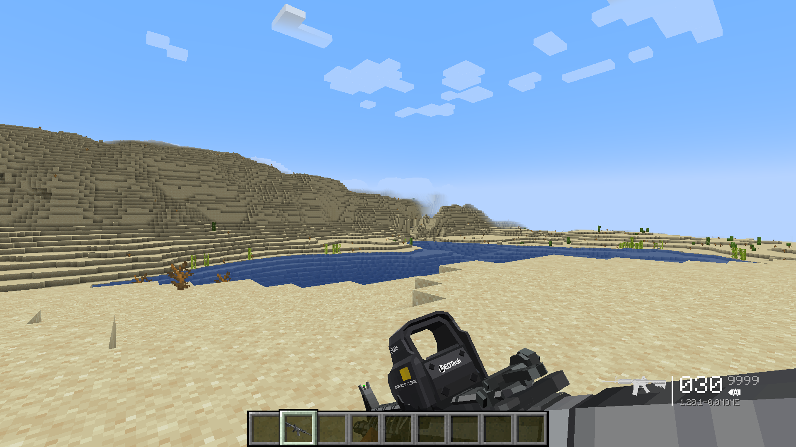
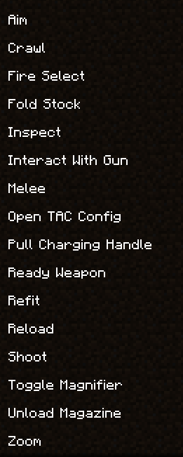
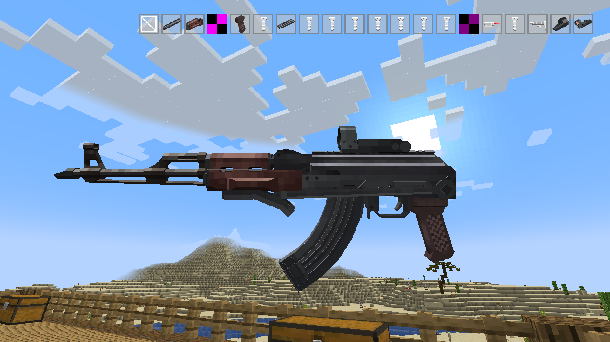
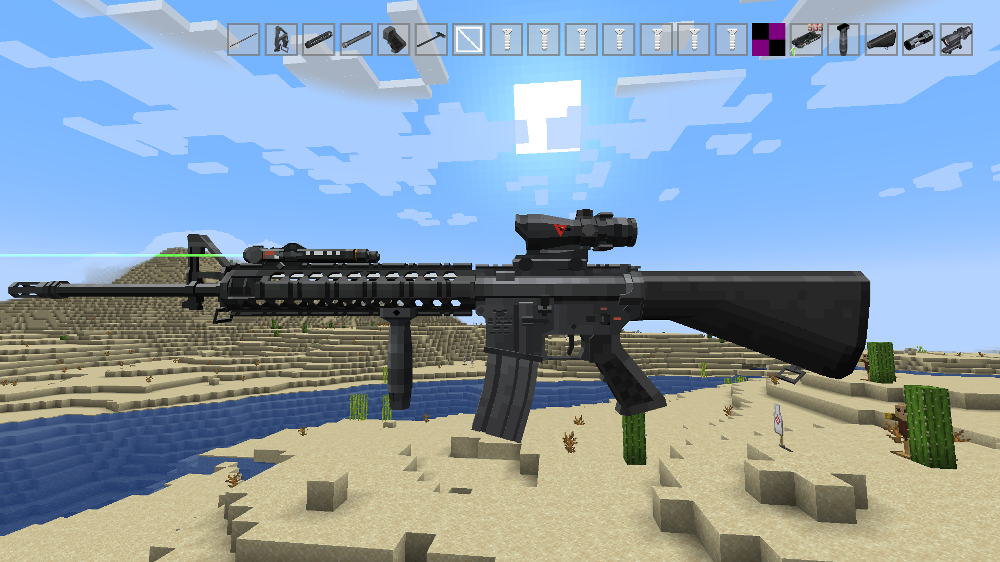
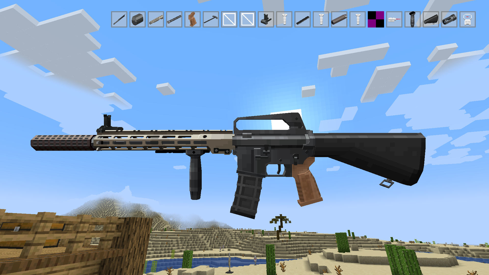
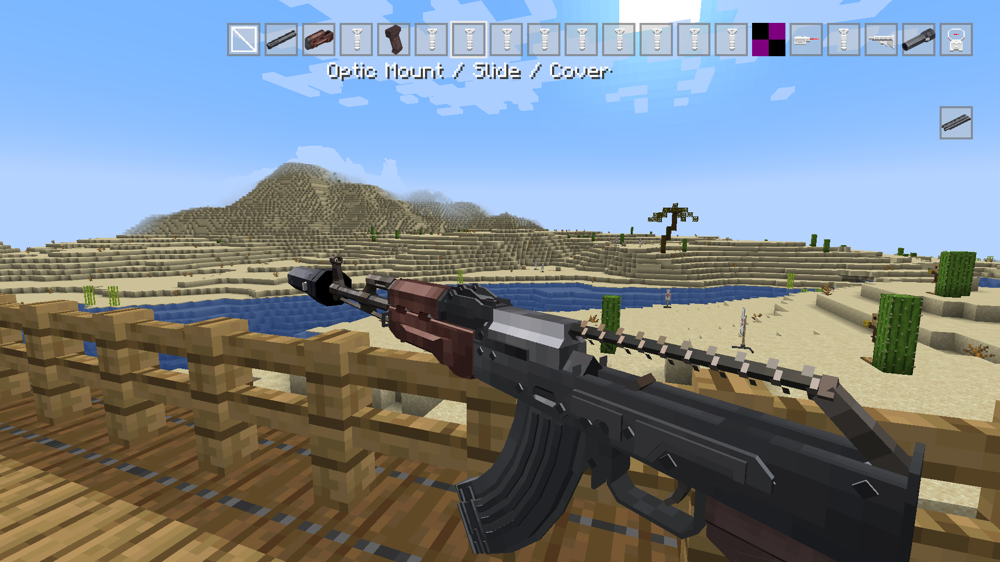

 

 A total "overhaul" of TacZ 1.1.7 with new features 

 

 Modular Attachment System 
 

 Magazines and Animated Firearm Manipulations 

Rough Project Scope & Outline [here](https://docs.google.com/document/d/17dVBlS1kNZ8BBDibv30S84Fb3FFpDjXTLl2TkmrA0iU/edit?tab=t.0)

Check out the New Branch  [here](https://github.com/koolkid94/tacz_mags/tree/intellij-project) 

Currently, a private build, as assets are taken from pre-existing works. No release is planned. Overall design direction is trying to give the mod a more open-ended / "sandboxy" feel and to move away from the arcady feel of the base mod. Guns are no longer just stat tweaks of each-other, but each a unique item with its own intricacies and balancing issues implemented through ammunition choices and attachment accessibility. Attachment mounting system loosely models a variety of mounting solutions. 

Animations Needed:

mag_unload 
--> removing magazine 
mag_load 
--> inserting magazine 
mag_load_bolt 
--> inserting magazine on open bolt 
mag_load_empty 
--> inserting magazine on empty chamber 
breach_load 
--> single shot reloading 
prime 
--> manipulating charging handle to expel chamber 
prime_empty 
--> manipulating charging handle 
unjam (do later)  (low priority)
--> unjamming a stovepipe 
fold 
--> folding stock  
unfold 
--> unfolding stock  
low_ready  
--> place gun in low ready (safety on)  

and much much more...!

toggle (do later) (priority 1)
--> toggling magnifier 

elcan_swap_in(do later) (low priority)
--> move elcan lever in 
elcan_swap_out(do later)
--> move elcan lever out 
lpvo_dial_in(do later)
--> zoom lpvo in 
lpvo_dial_out(do later)
--> zoom lpvo out 
tactical (do later)
--> turn on/off laser/light/switch 
remove sight (do later)
--> remove equipped optic 
remove silencer (do later)
--> remove silencer 
remove grip (do later)
--> remove grip 

change batteries (do later) (low priority)
--> change batteries on optic  

 

 

--JAVA-- 
ModAnimationConstant --> constant, to be passed into lua machine 
LocalPlayerANIMATIONNAME --> client side handling of triggering of animation 
ModClientPlayerGunOperator --> interface holding the undefined function for the logic (be sure to sync with server thru messages) 
ANIMATIONNAMEKey --> handles keybind 
--LUA-- (in tacz default pack) 
DefaultStateMachineLua 
runANIMATIONNAME 
-(input getter function) 

