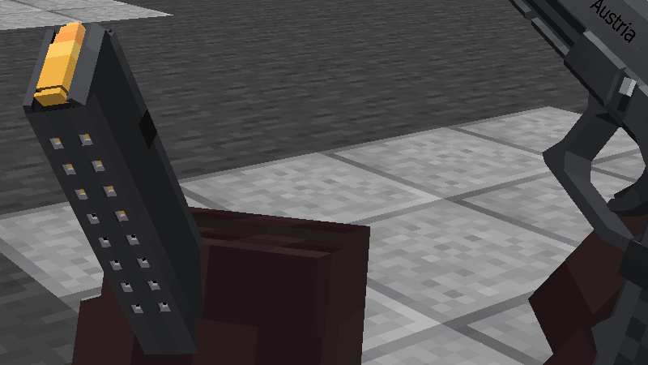

## Magazines

Magazines can accept [multiple different ammo types](https://github.com/koolkid94/koolkid94/blob/main/tacz_mags_wiki/Ballistics/readme.md), as configured in "magazines.json". Sometimes, not all the loaded bullets in a magazine will be of the proper type for the current gun, forcing the player to [prime](https://github.com/koolkid94/koolkid94/blob/main/tacz_mags_wiki/Weapon%20Handling/Length%20and%20Weight/readme.md) in order to continue shooting. 

### Single Loading

Without a magazine installed, some guns can be loaded through the ejection port with loose rounds. 

### Unloading and Loading

Magazines can be installed and removed from a gun.

### Windowed Magazines

If the magazine ID ends with "_w", it will render the bullets through a witness port.

