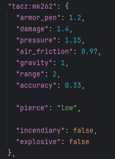

## Ammo Types

Various different ammo types, each with their own properties, can be loaded into a gun. Scopes will need to be zeroed based on load and barrel length.

## Attributes

Pressure is a special stat, as it influences [heat](https://github.com/koolkid94/koolkid94/blob/main/tacz_mags_wiki/Pressure%20System/Heat/readme.md), [pressure](https://github.com/koolkid94/koolkid94/blob/main/tacz_mags_wiki/Pressure%20System/readme.md), as well as increasing velocity and accuracy.

### Buckshot and Slugs
If slugs are loaded, it will slightly increase the accuracy of  whatever it is loaded into, as well as only firing a single pellet. Slug rounds are defined as slugs if the ammo id ends with "sl".

