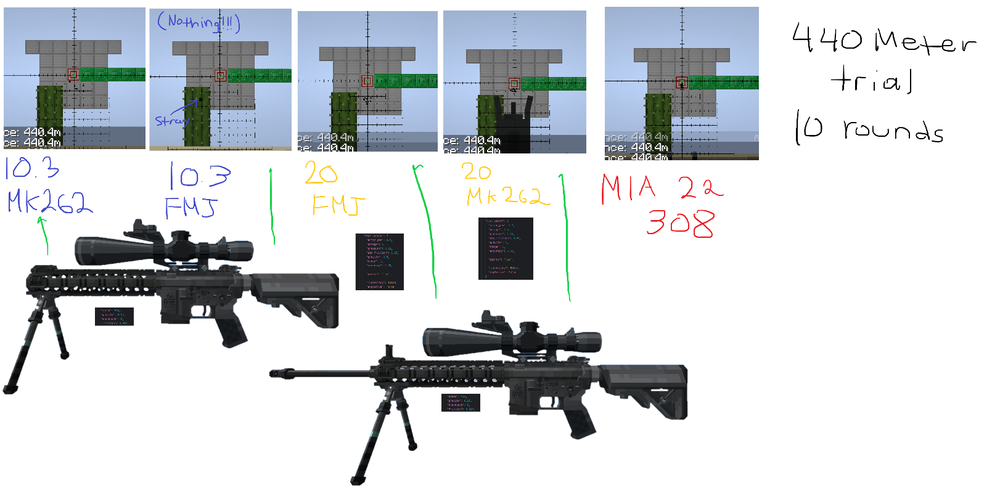

## Ammo Types

Various different ammo types, each with their own properties, can be loaded into a gun through various [magazines](https://github.com/koolkid94/koolkid94/blob/main/tacz_mags_wiki/Ballistics/Magazines/readme.md). Scopes will need to be zeroed based on load and barrel length.

## Attributes
```json
"tacz:ap63": {
    "armor_pen": 2,
    "damage": 1.15,
    "pressure": 0.93,
    "air_friction": 1.025,
    "gravity": 1.01,
    "range": 1.2,
    "accuracy": 0.9,

    "pierce": "low",

    "incendiary": false,
    "explosive": false
  }
```

Pressure is a special stat, as it influences [heat](https://github.com/koolkid94/koolkid94/blob/main/tacz_mags_wiki/Pressure%20System/Heat/readme.md), [pressure](https://github.com/koolkid94/koolkid94/blob/main/tacz_mags_wiki/Pressure%20System/readme.md), as well as increasing velocity and accuracy.

### Buckshot and Slugs
If slugs are loaded, it will slightly increase the accuracy of  whatever it is loaded into, as well as only firing a single pellet. Slug rounds are defined as slugs if the ammo id ends with "sl".


