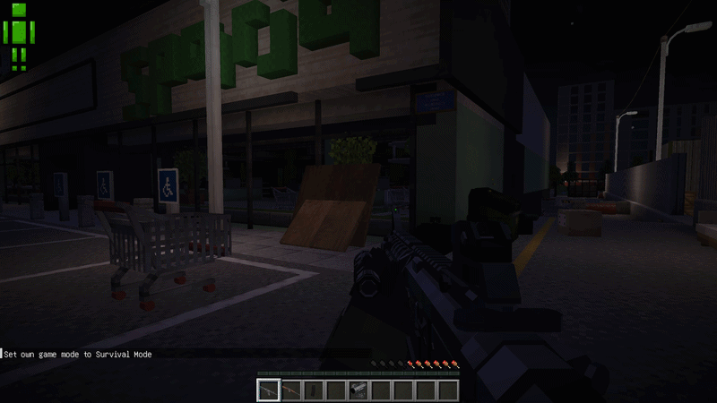

## TaCZ Tweaks

Using a modified version of [MUKCS's TaCZ Tweaks](https://github.com/MUKSC/TaCZTweaks) mod, features like bullet sounds, particle effects, and destruction are enabled.
 

## TaCZ Additions

[Raiiiden's TaCZAdditions](https://github.com/Raiiiden/TacZAdditions-1.20.1) works fine just out of the box, though the scope sway should be disabled. 
 

## Handheld Moon

Tentative compatability with [Handheld Moon](https://github.com/Tower-of-Sighs/HandheldMoon). The liscence is a bit restrictive, and for compatability it does require an edited version of the mod, but it does work.

## TaCZ Presence

A custom version of [TaCZ Precense](https://github.com/AlfredoAlessandro/Tacz-Presence) is used for visual and particle effects. 