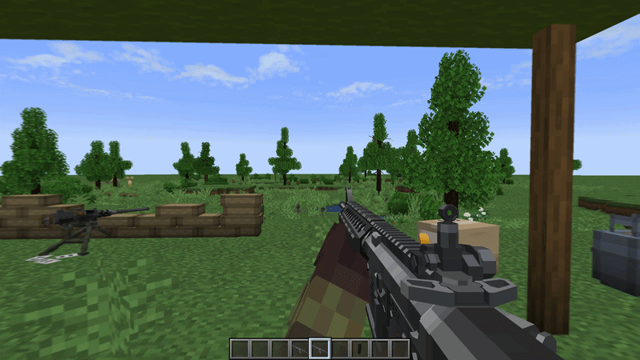

# Pressure System

Pressure is largely determined by attachments, specifically high backpressure silencers, barrel length, gasblocks, and the type of bullet fired. Guns can accept a [variety of bullets](https://github.com/koolkid94/koolkid94/blob/main/tacz_mags_wiki/Ballistics/readme.md) which act as a multiplier to the base gun's pressure stat. As pressure increases, so does the [heat](http://github.com/koolkid94/koolkid94/blob/main/tacz_mags_wiki/Pressure%20System/Heat/readme.md) per shot, bullet velocity, as well as the sound volume of the gun.
 

## Gas

Higher pressure guns will increase the amount and opacity of the gas coming out of the barrel. 

## Failure to Cycle

Each gun has a threshold for the minimum pressure it requires in order to automatically cycle the action. If the previously fired bullet did not surpass this threshold, then the gun will fail to eject the casing, requiring the player to [prime](https://github.com/koolkid94/koolkid94/blob/main/tacz_mags_wiki/Weapon%20Handling/Canted%20Aiming/readme.md) the gun in order to manually chamber the next round.

The cycle check is calculated as:

$$G = \prod_{i=1}^{n} \text{attachmentPressure}_i(\text{ammoPressure}) - \text{rand}$$

where **rand** is a random value between 0.01 and 0.07. If $G > MinPressure$, the action cycles successfully. Minimum Pressure is 0.75 by default, but can be changed in the gun's data file.
