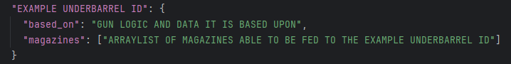

## Underbarrels

Underbarrels can be equipped on guns. The default keybind is X. Both single tube and magazine fed underbarrels can accept multiple different ammo types.

Underbarrels can be mag fed. If mag fed, the player must manually [prime](https://github.com/koolkid94/koolkid94/blob/main/tacz_mags_wiki/Weapon%20Handling/Canted%20Aiming/readme.md) between shots to cycle the action.
 

 
Traditional tube underbarrels also work just fine. In the example gif [Vinlanx's Explosion Overhaul](https://vinlanx.github.io/explosion-overhaul-site/) is used.
 

| Function     | Animation Name             |
|--------------|----------------------------|
| Equip        | "sub_transform_UBID"       |
| Static Idle  | "sub_static_idle_UBID"     |
| Shoot        | "sub_shoot_UBID"           |
| UnEquip      | "transform_UBID"           |
| Draw         | "sub_draw_UBID"            |
| Stow         | "sub_put_away_UBID"        |
| Inspect      | "sub_inspect_UBID"         |
| Reload       | "sub_reload_tactical_UBID" |
| Reload Empty | "sub_reload_empty_UBID"    |
 

 
In order to get animated underbarrels, it uses the "attachment_adapter". The attachment is always a part of the gun, it only shows up once its corresponding "attachment_adapter" is installed. It is reccomended that in "master_parameter_attachment.json" to set the grip translation to be [1000,1000,1000], to avoid any model clipping.
 
 
 
The underbarrels are declared in "underbarrels.json"
 

 

