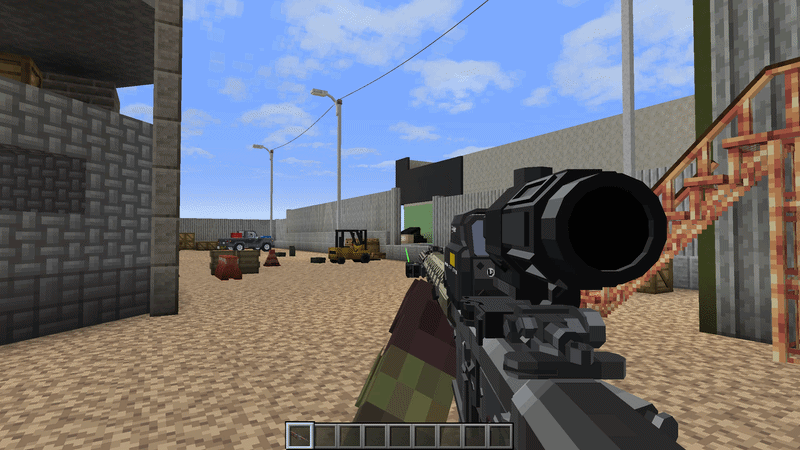

## Canted Aiming

Pressing keybind (T by default) will tilt the gun to the side. Currently, does not provide any sort of accuracy bonus, but it does not decrease sensitivity, making it useful in close quarters when only a high power optic is installed. Care should be taken when animating to make sure the canted aim perspective looks alright.

## Toggle Magnifier

Pressing keybind (X by default) will swap between predefined attachment pairs from defined from "HHS Swap Config". 

## Manual Priming

Pressing keybind (L by default) will manually cycle the action of the gun. This is useful if the gun fails to cycle [due to low pressure](https://github.com/koolkid94/koolkid94/blob/main/tacz_mags_wiki/Pressure%20System/readme.md) and fails to eject the fired projectile's casing. It can also be used to chamber the next round without firing, though the bullet is not refunded. 
 

## Ready States
Guns can be held at a lower than ready stance. This is largely a cosmetic feature. The disarming appearance of the lowered gun is shown in 3rd person. [KosmX's Player Animator](https://github.com/KosmX/minecraftPlayerAnimator) is recommended. 

## Folding Stocks
Some stocks can be collapsed to make the overall weapon [shorter](https://github.com/koolkid94/koolkid94/blob/main/tacz_mags_wiki/Weapon%20Handling/Length%20and%20Weight/readme.md), as configured by "folding_stocks.json".

## Mag Checking
Pressing keybind (M by default) will reveal the contents of the current magazine.

