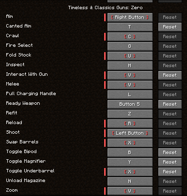

## Weapon Handling
> There are many new animated weapon manipulations that all interface with each other. The default keybinds are listed below.
>
>

Gun data changes are [here](https://github.com/koolkid94/koolkid94/blob/main/tacz_mags_wiki/Rework/readme.md).

- [New Controls](https://github.com/koolkid94/koolkid94/blob/main/tacz_mags_wiki/Weapon%20Handling/Canted%20Aiming/readme.md)
- [Bipods & Sway](https://github.com/koolkid94/koolkid94/tree/main/tacz_mags_wiki/Weapon%20Handling/Bipods%20and%20Sway/readme.md)
- [Length & Weight](https://github.com/koolkid94/koolkid94/blob/main/tacz_mags_wiki/Weapon%20Handling/Length%20and%20Weight/readme.md)