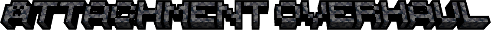
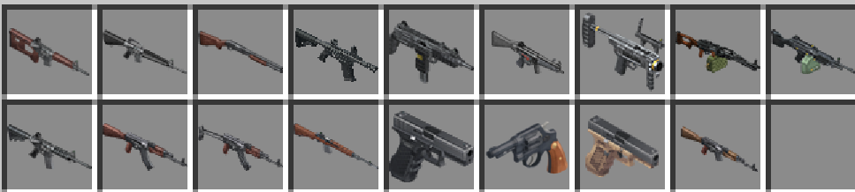
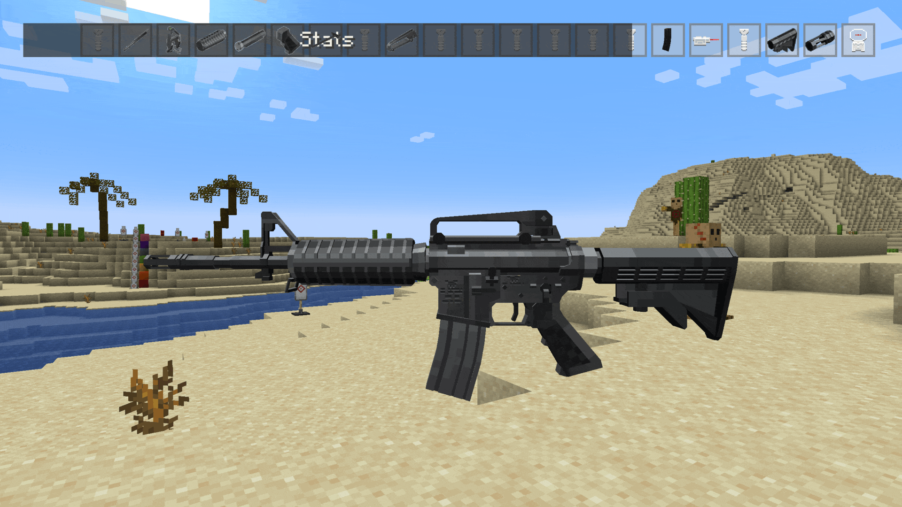
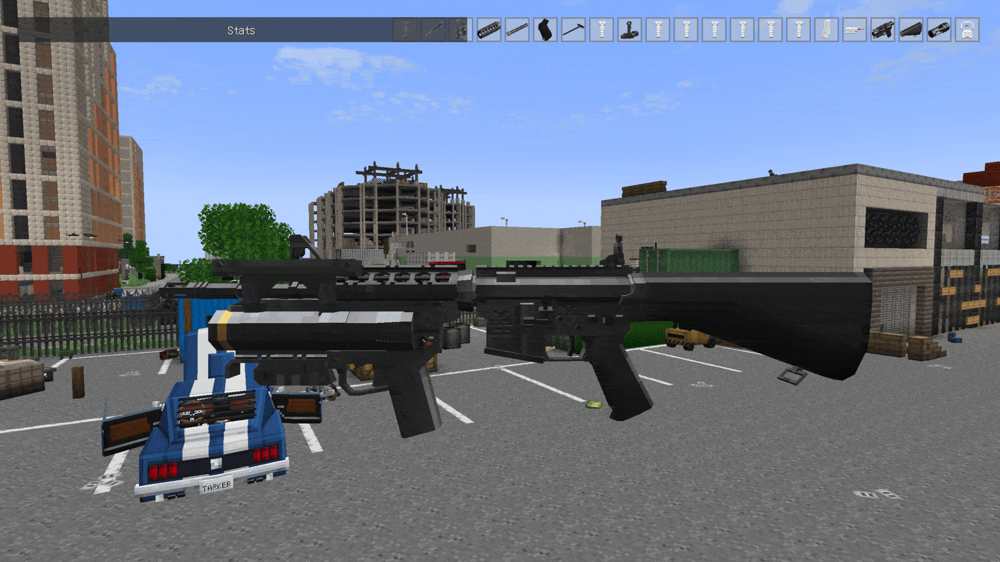
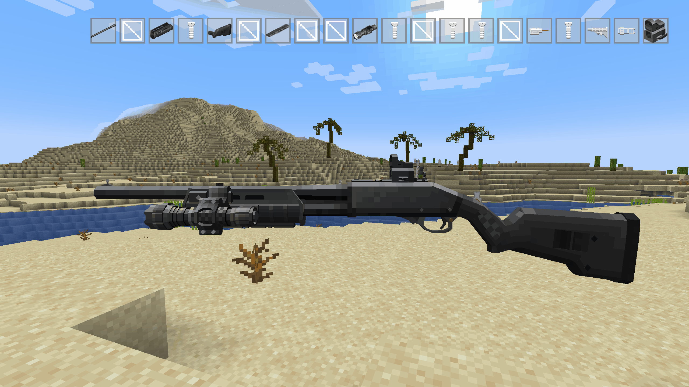

   

> A total 'overhaul' of Tacz 1.1.7 - modular attachments, magazines, and animated firearm manipulations.

Rough Project Scope & Outline [here](https://docs.google.com/document/d/17dVBlS1kNZ8BBDibv30S84Fb3FFpDjXTLl2TkmrA0iU/edit?tab=t.0).

Check out the New Branch  [here](https://github.com/koolkid94/tacz_mags/tree/intellij-project)!

## Current Features

- [Firearm Gas/Pressure System]
- [Weapon Handling/Manipulations & Length](https://github.com/koolkid94/koolkid94/tree/main/tacz_mags_wiki/Weapon%20Handling)
- [Underbarrels](https://github.com/koolkid94/koolkid94/tree/main/tacz_mags_wiki/Underbarrels)
- [Other Mod Integrations](https://github.com/koolkid94/koolkid94/tree/main/tacz_mags_wiki/Mod%20Integrations)
- [Variable Ballistics]

## WIP

- Jamming & Durability
- PIP Scopes
- Complete Animation Set

---

Currently a private build - assets sourced from pre-existing works. No public release planned.

Damage
Accuracy
Heating/Cooling Rates
Fire Rate
Length
weight
ADS Time
Recoil
Damage Dropoff
Attachment Compatability (Magazine Sizes, Scopes)
Loudness
Particulate Clutter (gas and other obscuring particle effects)

Overall design direction aims for a more open-ended, "sandboxy" feel. Guns are no longer stat tweaks of each other but each a unique item with its own intricacies and balancing, implemented through ammunition choices and attachment accessibility. The attachment mounting system loosely models a variety of real-world mounting solutions.

## Planned List — 17/131 complete

| ✅ Done (WIP) | 🔲 Planned      |
|--------------|-----------------|
| ✅ ADAR-215   | 9A-91           |
| ✅ AKMN       | AEK-965         |
| ✅ AKMSN      | AK-12           |
| ✅ Glock 17   | AK-74           |
| ✅ Glock 18   | AK100S          |
| ✅ M16        | AKS-74U         |
| ✅ M1A        | APB             |
| ✅ M249       | AS VAL          |
| ✅ M26 MASS   | ASH-12          |
| ✅ M320       | AUG             |
| ✅ M4A1       | AWP             |
| ✅ M870       | AXMC            |
| ✅ MP5        | B93R            |
| ✅ PKM        | C11             |
| ✅ SN38       | CZ75            |
| ✅ UZI        | DEAGLE          |
| ✅ VPO 209    | DP-12           |
|              | DVL-10          |
|              | FN EVOLYS       |
|              | FN57            |
|              | FORT 12         |
|              | G28             |
|              | G3              |
|              | G36             |
|              | GL40            |
|              | GLOCK 19        |
|              | GP-41           |
|              | GS-18           |
|              | HK416           |
|              | HK417           |
|              | IZH-58          |
|              | KEDR            |
|              | KS-23           |
|              | KSG             |
|              | LR-300          |
|              | M1014           |
|              | M107            |
|              | M110 SASS       |
|              | M1216           |
|              | M203            |
|              | M45A1           |
|              | M60             |
|              | M7 SPEAR        |
|              | M700            |
|              | M79             |
|              | M95             |
|              | M9A2            |
|              | MAKAROV         |
|              | MCX             |
|              | MDR 308         |
|              | MDR 556         |
|              | MGL             |
|              | MINI 14         |
|              | MK-47           |
|              | MK18            |
|              | MK20 SCAR       |
|              | MK46 LMG        |
|              | MOSIN           |
|              | MP-155          |
|              | MP-153          |
|              | MP-443          |
|              | MP5K            |
|              | MP5SD           |
|              | MP7             |
|              | MP9             |
|              | MPX             |
|              | MRAD            |
|              | NSWC MK13 CRANE |
|              | OTS-14          |
|              | OTS-33          |
|              | P226            |
|              | P320            |
|              | P90             |
|              | PL-15           |
|              | PP-19           |
|              | PP200           |
|              | PPSH            |
|              | QFIX            |
|              | RD704           |
|              | RFB             |
|              | RPD             |
|              | RPG-26          |
|              | RPG-7           |
|              | RPK-16          |
|              | RPK16           |
|              | RPL-20          |
|              | SAIGA-12        |
|              | SAKO ARG        |
|              | SAKO TRG        |
|              | SCAR-H          |
|              | SCAR-L          |
|              | SIX12           |
|              | SKS             |
|              | SPAS-15         |
|              | SR-1            |
|              | SR-25           |
|              | SR2M            |
|              | SR3M            |
|              | STRIKER 12      |
|              | SV98            |
|              | SVD             |
|              | SVU             |
|              | T5000           |
|              | TOZ 106         |
|              | TT33            |
|              | UMP45           |
|              | USP45           |
|              | VECTOR 45       |
|              | VECTOR 9        |
|              | VIPER 2011      |
|              | VPO 101         |
|              | VPO 215         |
|              | VSS             |
|              | ZBROYAR Z-10    |
